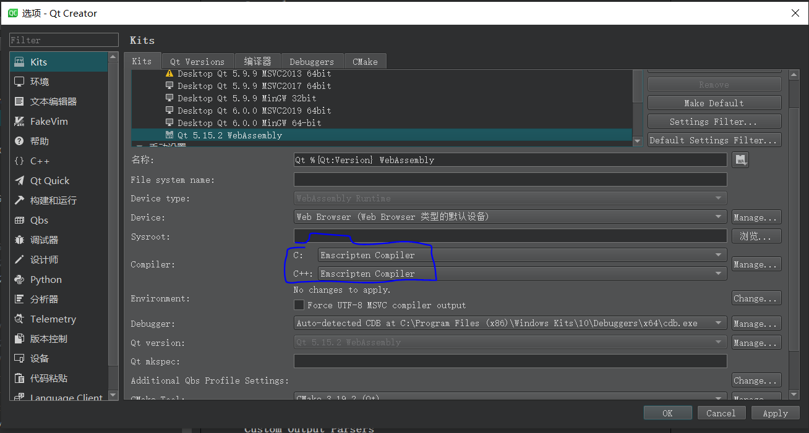

# WebAssEmbly 环境搭建

WebAssembly是一种二进制格式，允许在网页中使用沙盒式可执行代码。这种格式几乎与本机代码一样快，并且现在所有主要的Web浏览器都支持这种格式。

Qt for WebAssembly是一个平台插件，可让您构建Qt应用程序，并将其集成到您的网页中。它不需要任何客户端安装，并减少了服务器端资源的使用。

[https://www.wasm.com.cn/](https://www.wasm.com.cn/)

[https://doc.qt.io/qt-5/wasm.html](https://doc.qt.io/qt-5/wasm.html)

## 前期配置

想要编译成WebAssembly，你首先需要先编译 LLVM。这是运行后续工具的先决条件。

* Git。Linux 和 OS X 系统中好像已经默认装好了，在 Windows 上需要在这里安装 Git。
* CMake。在 Linux 和 OS X系统中，你可以使用包管理工具 apt-get 或 brew 来安装。如果是 Windows 系统，你可以点击这里。
* 系统编译工具。Linux上，安装 GCC。OS X 上，安装 Xcode。Windows 上安装 Visual Studio 2015 Community with Update 3 或更新版本。
* Python 2.7.x，在 Linux 和 OS X上，很可能已经装好了。看这里。
* 安装完毕后，确认 git，cmake 和 python 已经在你的环境变量里，可以使用。

## 安装Emscripten

emscripten是用于编译为asm.js和WebAssembly的工具链。它使您无需插件即可以接近本机的速度在Web上运行Qt。

Qt的每个次要版本都支持一个已知良好的Emscripten版本。该Emscripten版本将在该Qt版本的生命周期内受支持。


已知的良好版本是：
* Qt 5.12：1.38.16
* Qt 5.13：1.38.27（多线程：1.38.30）
* Qt 5.14：1.38.27（多线程：1.38.30）
* Qt 5.15：1.39.8

使用emsdk安装特定的emscripten版本。例如，要为Qt 5.15安装它，请输入：

```
git clone https://github.com/juj/emsdk.git
cd emsdk
./emsdk install 1.39.8
./emsdk activate --embedded 1.39.8
```

这些步骤完成以后，安装完成。将 Emscripten 的环境变量配置到当前的命令行窗口下。

```
$ source ./emsdk_env.sh
```

这条命令将相关的环境变量和目录入口将会配置在当前的命令行窗口中。

在 Windows中，./emsdk 使用 emsdk 代替，source ./emsdk_env.sh 使用 emsdk_env 代替。

在windows下这样只是应用了临时环境变量，需要永久生效的话，要手动去设置

将emsdk目录下的.emscripten文件复制到C:\Users\Administrator目录下（即用户目录），Qt for WebAssEmbly构建套件编译的时候会去这里找编译器和各种编译需要的变量。

```
import os
NODE_JS = 'emsdk绝对路径/node/14.15.5_64bit/bin/node.exe'
PYTHON = 'emsdk绝对路径/python/3.7.4-pywin32_64bit/python.exe'
JAVA = 'emsdk绝对路径/java/8.152_64bit/bin/java.exe'
LLVM_ROOT = 'emsdk绝对路径/upstream/bin'
BINARYEN_ROOT = 'emsdk绝对路径/upstream'
EMSCRIPTEN_ROOT = 'emsdk绝对路径/upstream/emscripten'
TEMP_DIR = 'emsdk绝对路径/tmp'
COMPILER_ENGINE = NODE_JS
JS_ENGINES = [NODE_JS]
```

之后在Qt Creator 选项中配置即可



